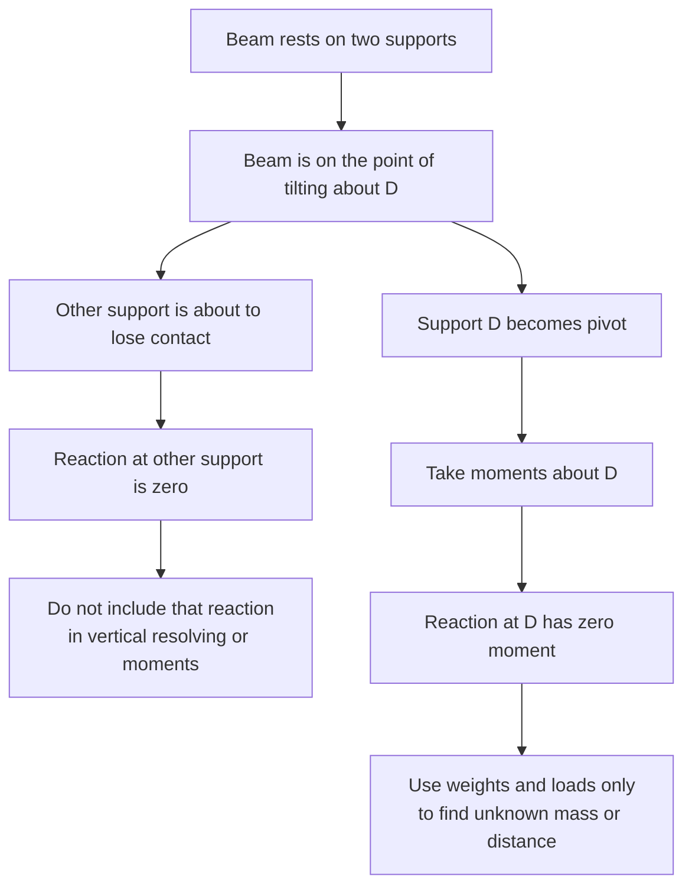

# A22MomentsMermaid-008

## Asset ID

`A22MomentsMermaid-008`

## Source

MechYr2 Chapter 4 Moments, pages 20 to 22; Rigid Bodies transcript section 8.

## Related lesson section

Worked Example 10; Common Mistakes and Exam Traps.

## Purpose

Point of tilting rule.

