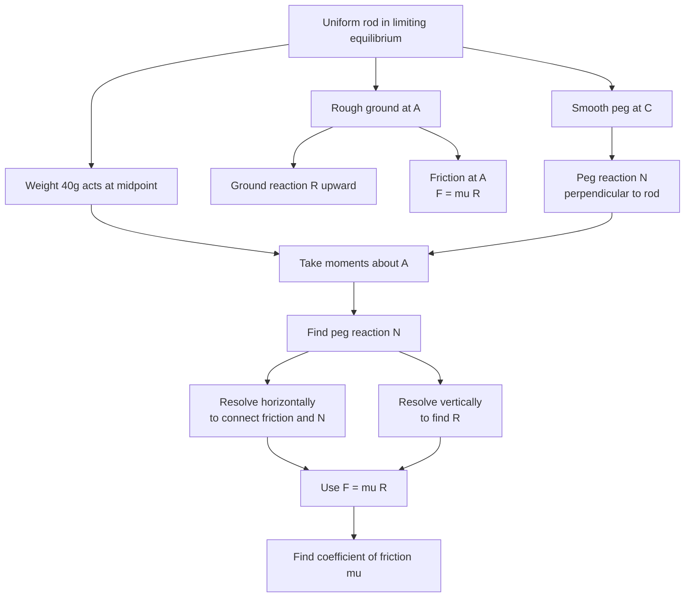

# A22MomentsMermaid-009

## Asset ID

`A22MomentsMermaid-009`

## Source

MechYr2 Chapter 7 Applications of Forces, page 15.

## Related lesson section

Worked Example 11.

## Purpose

Rough rod with smooth peg.

