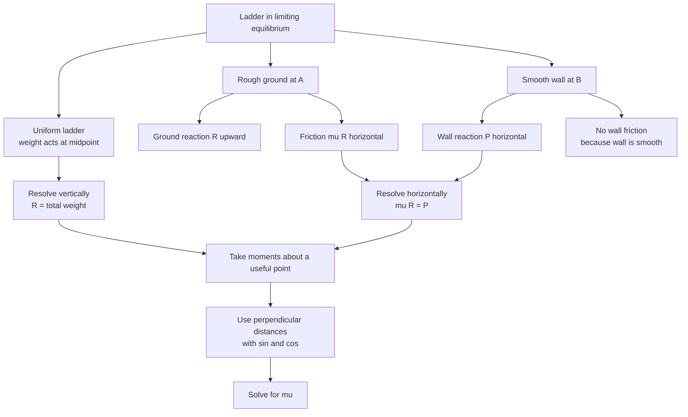

# A22MomentsMermaid-010

## Asset ID

`A22MomentsMermaid-010`

## Source

MechYr2 Chapter 7 Applications of Forces, page 16; Rigid Bodies transcript ladder sections.

## Related lesson section

Worked Example 12.

## Purpose

Ladder model.

