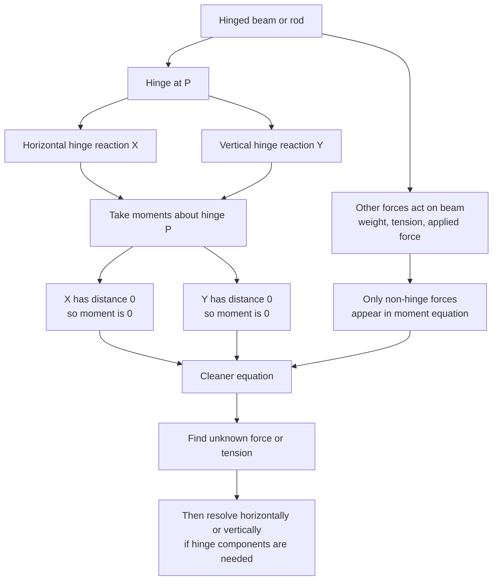

# A22MomentsMermaid-011

## Asset ID

`A22MomentsMermaid-011`

## Source

CCEA A22-MOM boundary mentioning hinged beams; Rigid Bodies transcript hinge sections.

## Related lesson section

Worked Example 13; Core Theory 8.

## Purpose

Hinged beam moment method.

