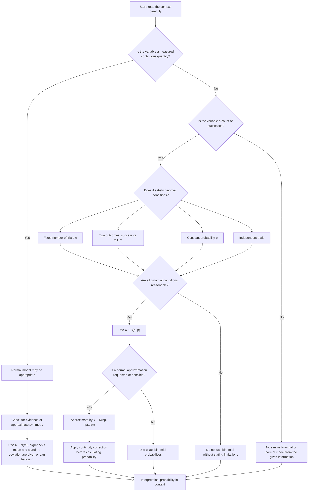

# A22NormalDistributionMER-001

## Asset ID
`A22NormalDistributionMER-001`

## Source
CCEA GCE Mathematics Specification Map, `A22-NORMAL-LO003`; Phase 1 lesson sections on distribution choice and binomial-to-normal approximation.

## Related lesson section
`Core Theory Part 6: Binomial-to-Normal Approximation`

## Purpose
Show how to choose between a binomial model, a normal model, a normal approximation to a binomial model, or no simple model.

