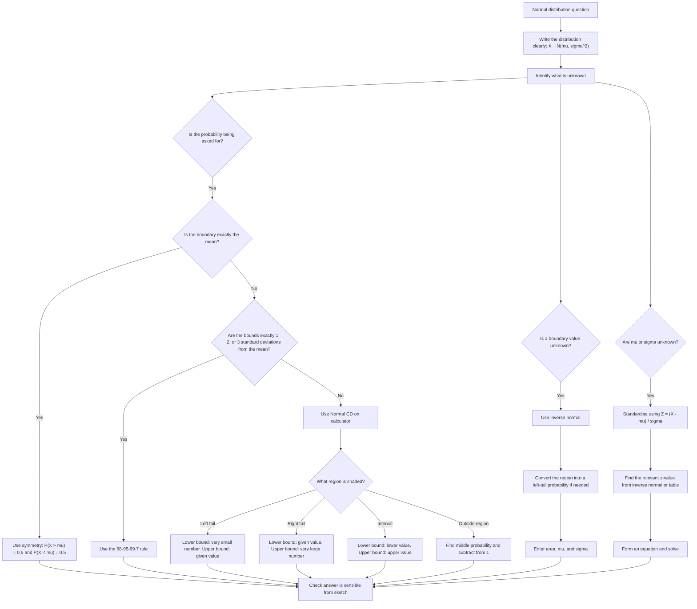

# A22NormalDistributionMER-002

## Asset ID
`A22NormalDistributionMER-002`

## Source
Teacher transcript and slide PDF normal probability workflow; CCEA `A22-NORMAL-LO001`, `A22-NORMAL-LO002`, and `A22-NORMAL-LO003`.

## Related lesson section
`Core Theory Part 2`, `Core Theory Part 3`, and `Core Theory Part 4`.

## Purpose
Give students a decision route for normal probability questions: symmetry, 68-95-99.7 rule, calculator Normal CD, inverse normal, or standardising.

