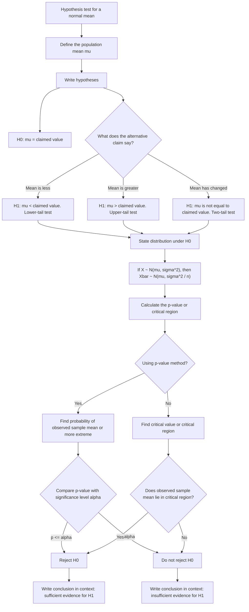

# A22NormalDistributionMER-003

## Asset ID
`A22NormalDistributionMER-003`

## Source
CCEA `A22-HT-LO001`, `A22-HT-LO002`, and `A22-HT-LO004`; Phase 1 adjacent hypothesis-testing section.

## Related lesson section
`Core Theory Part 8: Hypothesis Testing on the Sample Mean`

## Purpose
Show the decision route for a hypothesis test for the mean of a normal distribution with known, given or assumed variance.

