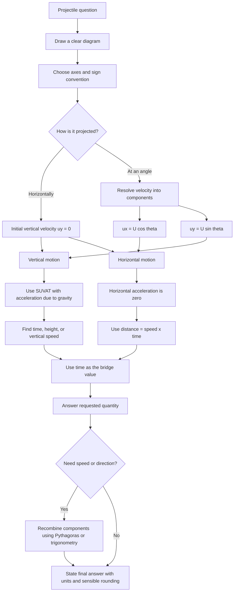

# A22ProjectilesMermaid-001

**Source:** CCEA A22-KIN specification map, teacher transcript, Phase 1 lesson structure.  
**Related lesson section:** Core Theory, Exam Technique, Worked Examples.  
**Purpose:** Show the overall projectile problem-solving workflow.

