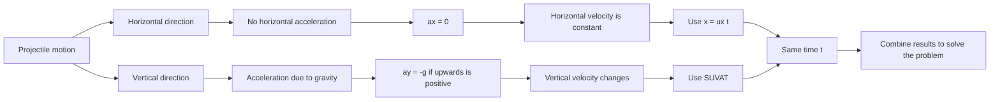

# A22ProjectilesMermaid-002

**Source:** Teacher transcript and DrFrost projectiles PDF.  
**Related lesson section:** Big Picture Explanation, Key Definitions and Notation, Core Theory.  
**Purpose:** Show the essential split between horizontal and vertical motion.

