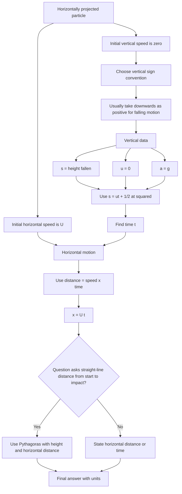

# A22ProjectilesMermaid-003

**Source:** Teacher transcript: horizontally projected particle examples.  
**Related lesson section:** Worked Examples 1 to 3.  
**Purpose:** Show the method for a particle projected horizontally from a height.

