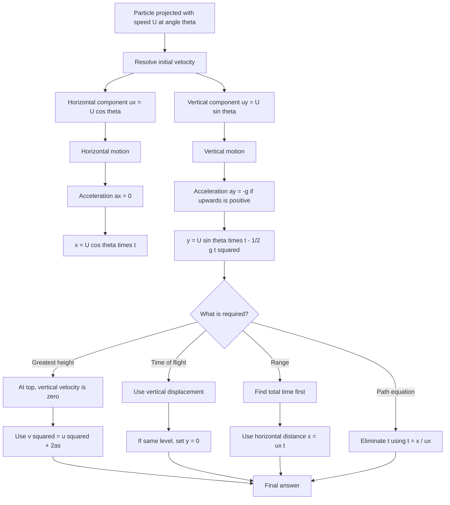

# A22ProjectilesMermaid-004

**Source:** Teacher transcript: angled projection examples and formula derivations.  
**Related lesson section:** Core Theory, Worked Example 4, Worked Example 5.  
**Purpose:** Show the angled projection workflow.

