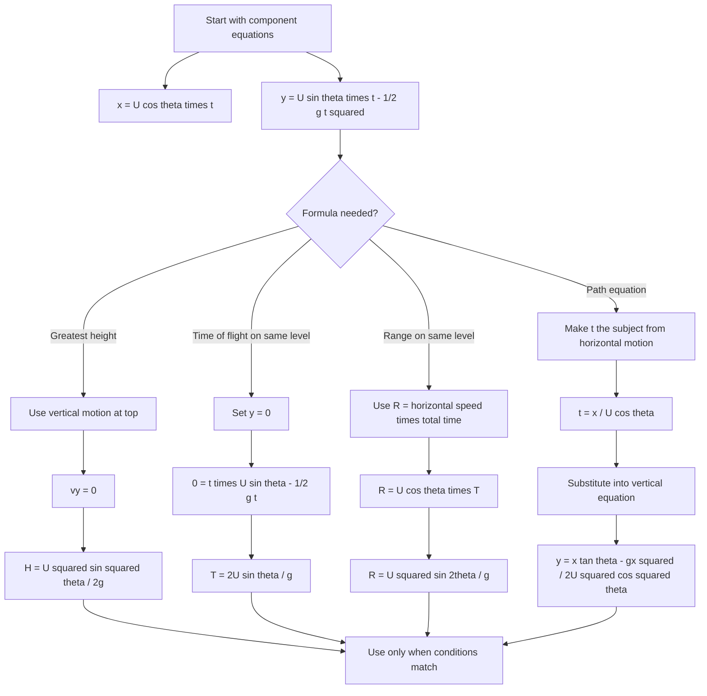

# A22ProjectilesMermaid-005

**Source:** CCEA elaboration for projectile formula derivation, Phase 1 Core Theory.  
**Related lesson section:** Core Theory.  
**Purpose:** Show how standard projectile formulae are derived.

