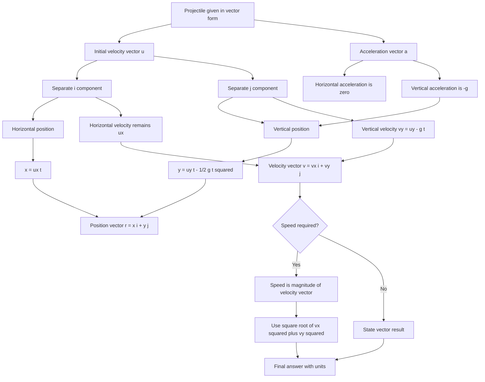

# A22ProjectilesMermaid-006

**Source:** Teacher transcript vector projectile example; CCEA A22-KIN two-dimensional kinematics outcomes.  
**Related lesson section:** Worked Example 7.  
**Purpose:** Show how to solve a projectile problem written in vector form.

