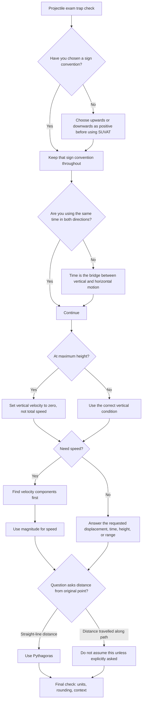

# A22ProjectilesMermaid-007

**Source:** Phase 1 exam traps and transcript warning about time as the bridge value.  
**Related lesson section:** Common Mistakes and Exam Traps, Exam Technique.  
**Purpose:** Show danger signs in projectile questions.

