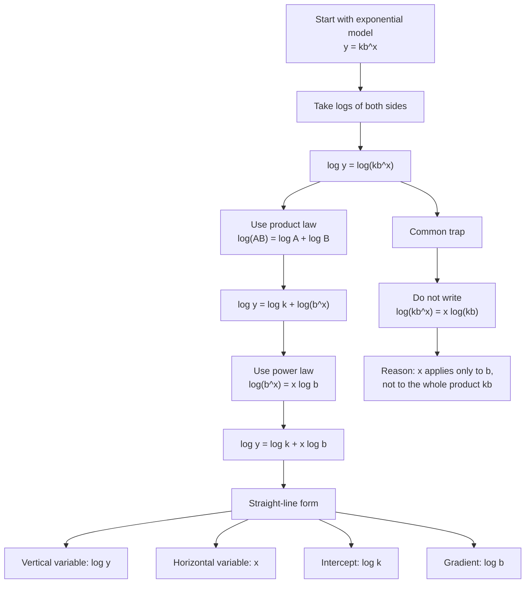

# A22StatisticalHypothesisTestingMERMAID-002

## Asset metadata

- Asset ID: A22StatisticalHypothesisTestingMERMAID-002
- Unit code: A22
- Topic code: A22-HT
- Topic name: Statistical hypothesis testing
- Related lesson section: Core Theory, Section 3: Turning an exponential model into a straight-line model
- Source: Lesson transcript; Stats Yr2 Chapter 1 PDF pages on exponential regression; AS1 exponentials/logarithms support
- Purpose: Preserve the algebraic pathway from an exponential model to a straight-line model.
- Status: Phase 2 Mermaid draft

## Mermaid code

