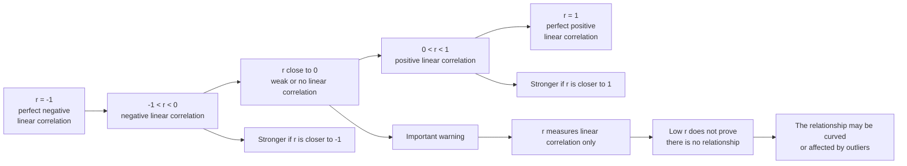

# A22StatisticalHypothesisTestingMERMAID-003

## Asset metadata

- Asset ID: A22StatisticalHypothesisTestingMERMAID-003
- Unit code: A22
- Topic code: A22-HT
- Topic name: Statistical hypothesis testing
- Related lesson section: Key Definitions and Notation; Core Theory, Section 4
- Source: CCEA specification map; lesson transcript; Stats Yr2 Chapter 1 PDF
- Purpose: Show the interpretation of PMCC values and remind students that PMCC measures linear correlation only.
- Status: Phase 2 Mermaid draft

## Mermaid code

