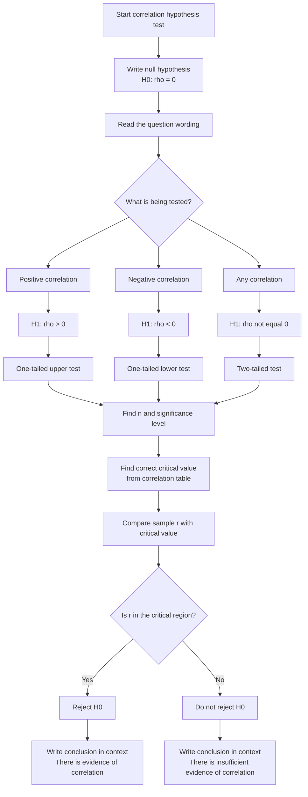

# A22StatisticalHypothesisTestingMERMAID-004

## Asset metadata

- Asset ID: A22StatisticalHypothesisTestingMERMAID-004
- Unit code: A22
- Topic code: A22-HT
- Topic name: Statistical hypothesis testing
- Related lesson section: Core Theory, Section 8: Critical value method for correlation tests
- Source: CCEA specification map; lesson transcript; Stats Yr2 Chapter 1 PDF
- Purpose: Give students a reusable decision flowchart for correlation coefficient hypothesis tests.
- Status: Phase 2 Mermaid draft

## Mermaid code

