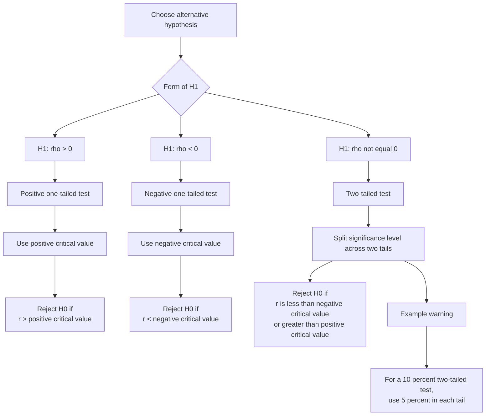

# A22StatisticalHypothesisTestingMERMAID-005

## Asset metadata

- Asset ID: A22StatisticalHypothesisTestingMERMAID-005
- Unit code: A22
- Topic code: A22-HT
- Topic name: Statistical hypothesis testing
- Related lesson section: Exam Technique; Common Mistakes and Exam Traps
- Source: CCEA specification map; lesson transcript; Stats Yr2 Chapter 1 PDF
- Purpose: Compare positive, negative and two-tailed correlation tests so students choose the correct critical region.
- Status: Phase 2 Mermaid draft

## Mermaid code

