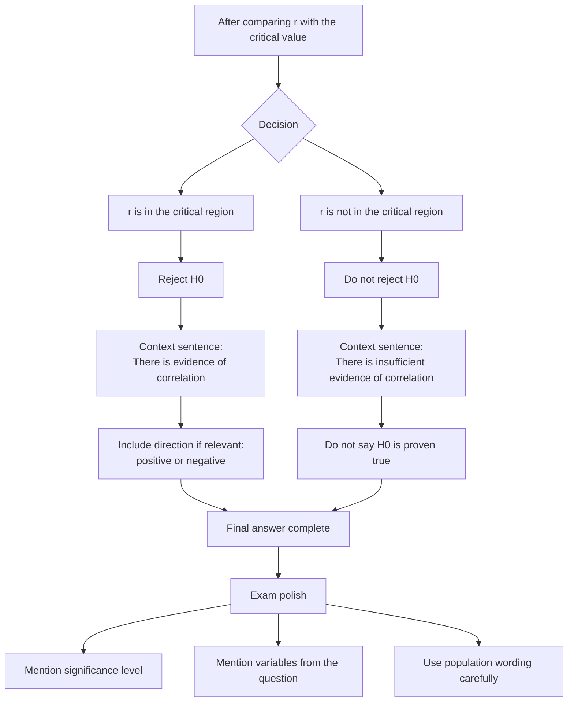

# A22StatisticalHypothesisTestingMERMAID-006

## Asset metadata

- Asset ID: A22StatisticalHypothesisTestingMERMAID-006
- Unit code: A22
- Topic code: A22-HT
- Topic name: Statistical hypothesis testing
- Related lesson section: Exam Technique; Full Worked Solutions
- Source: CCEA specification map; lesson transcript; Stats Yr2 Chapter 1 PDF
- Purpose: Show the required two-part conclusion structure: statistical decision plus contextual interpretation.
- Status: Phase 2 Mermaid draft

## Mermaid code

