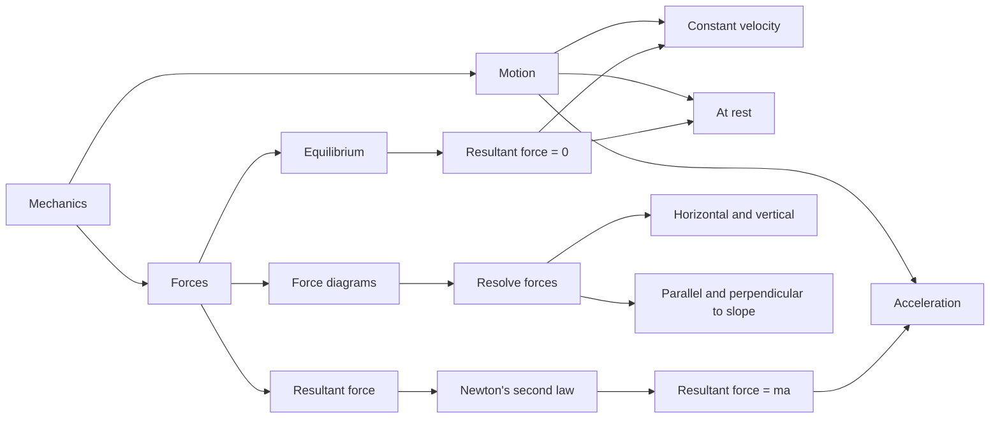

# AS2ForcesMER-001

**Asset ID:** AS2ForcesMER-001  
**Source:** CCEA specification map + Chapter 5/7 Forces transcript  
**Related lesson section:** Big Picture Explanation  
**Purpose:** Show how forces, motion, equilibrium and Newton’s second law fit together.

