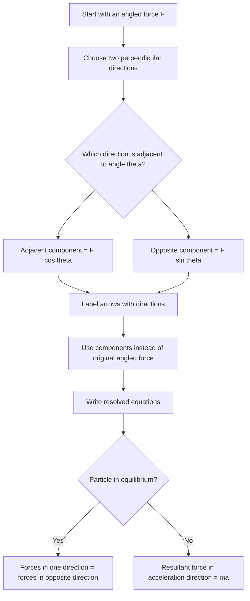

# AS2ForcesMER-002

**Asset ID:** AS2ForcesMER-002  
**Source:** Chapter 5/7 Forces transcript + MechYr2 Chapter 5 Friction PDF  
**Related lesson section:** Core Theory: Resolving a force into components  
**Purpose:** Show the decision workflow for resolving an angled force.

