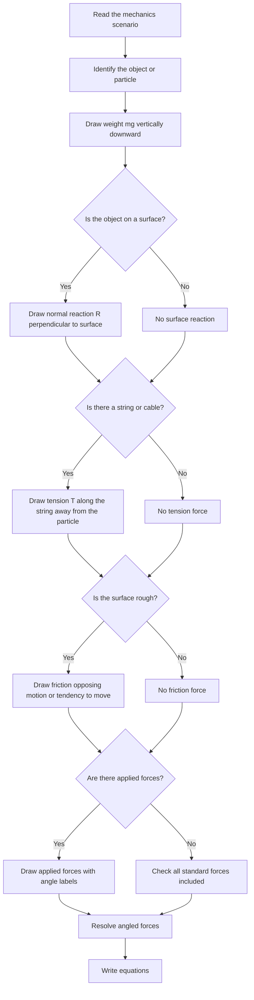

# AS2ForcesMER-003

**Asset ID:** AS2ForcesMER-003  
**Source:** Chapter 5/7 Forces transcript  
**Related lesson section:** Core Theory: Drawing force diagrams  
**Purpose:** Give a checklist for building a complete force diagram before calculation.

