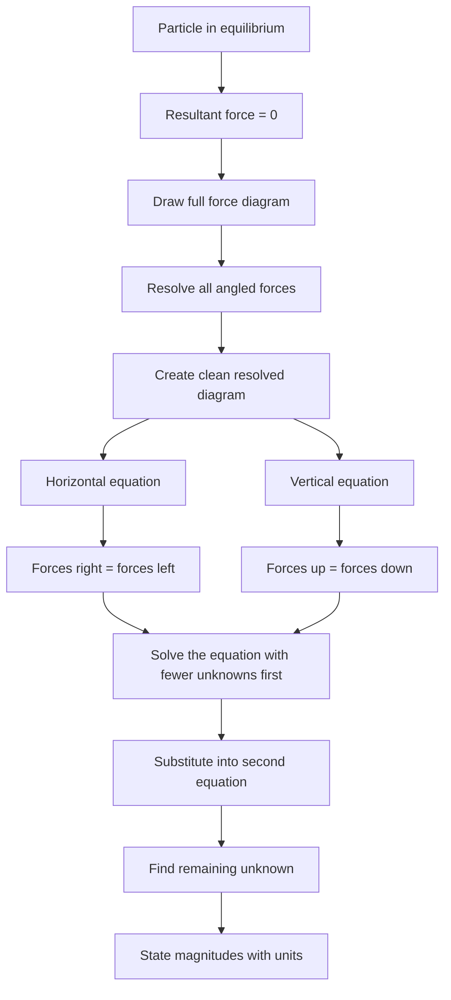

# AS2ForcesMER-004

**Asset ID:** AS2ForcesMER-004  
**Source:** Chapter 5/7 Forces transcript + MechYr2 Chapter 7 Applications of Forces PDF  
**Related lesson section:** Core Theory: Equilibrium equations  
**Purpose:** Show the method for static particles and balanced forces.

