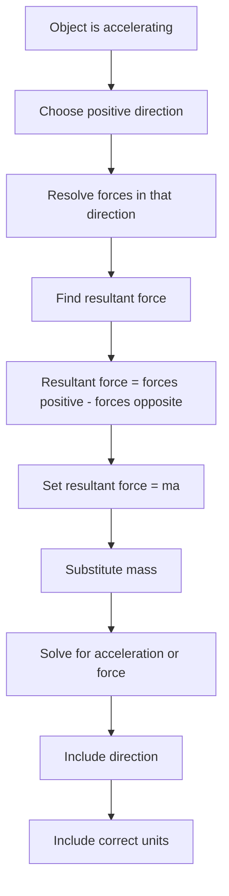

# AS2ForcesMER-005

**Asset ID:** AS2ForcesMER-005  
**Source:** CCEA specification map + Chapter 5/7 Forces transcript  
**Related lesson section:** Core Theory: Newton’s second law  
**Purpose:** Show how to apply $F=ma$ correctly as resultant force equals mass times acceleration.

