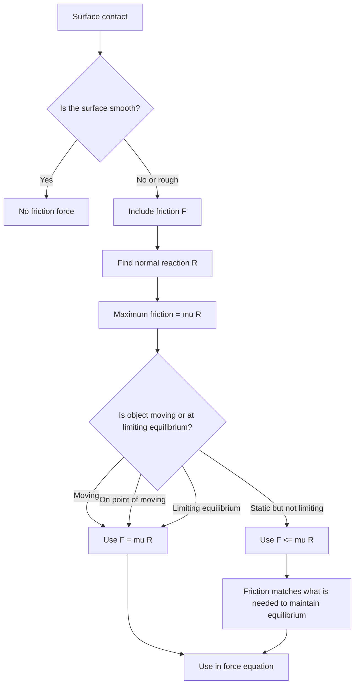

# AS2ForcesMER-006

**Asset ID:** AS2ForcesMER-006  
**Source:** CCEA specification map + Chapter 5/7 Forces transcript + MechYr2 Chapter 5 Friction PDF  
**Related lesson section:** Core Theory: The friction model  
**Purpose:** Show when to use no friction, $F\leq\mu R$, or $F=\mu R$.

