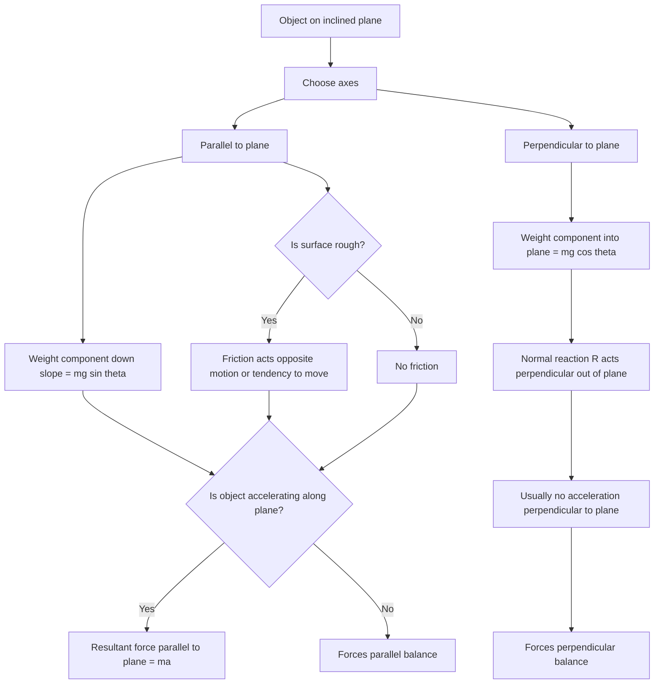

# AS2ForcesMER-007

**Asset ID:** AS2ForcesMER-007  
**Source:** Chapter 5/7 Forces transcript + MechYr2 Chapter 5 Friction PDF  
**Related lesson section:** Core Theory: Inclined planes  
**Purpose:** Show the preferred resolving directions and weight components on an inclined plane.

