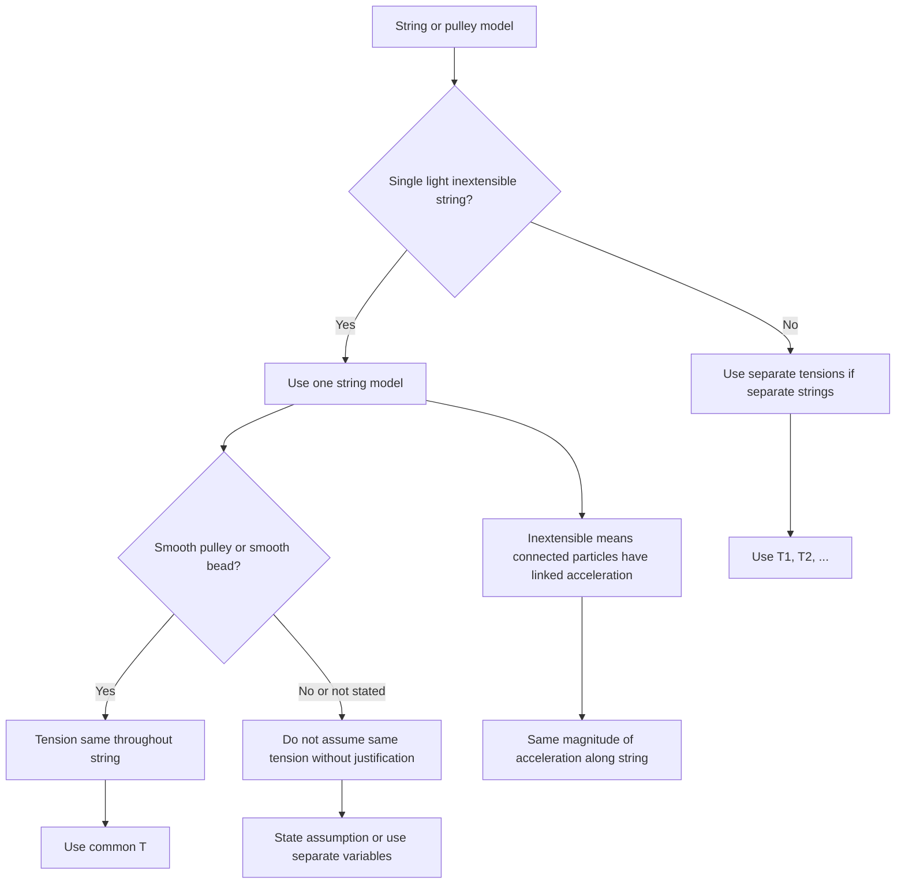

# AS2ForcesMER-008

**Asset ID:** AS2ForcesMER-008  
**Source:** Chapter 5/7 Forces transcript + MechYr2 Chapter 7 Applications of Forces PDF  
**Related lesson section:** Core Theory: Strings, pulleys and connected particles  
**Purpose:** Separate common modelling assumptions for strings, beads and pulleys.

