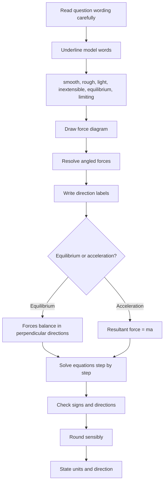

# AS2ForcesMER-009

**Asset ID:** AS2ForcesMER-009  
**Source:** Chapter 5/7 Forces transcript  
**Related lesson section:** Exam Technique Notes  
**Purpose:** Show the exam-safe order of work for mechanics questions.

