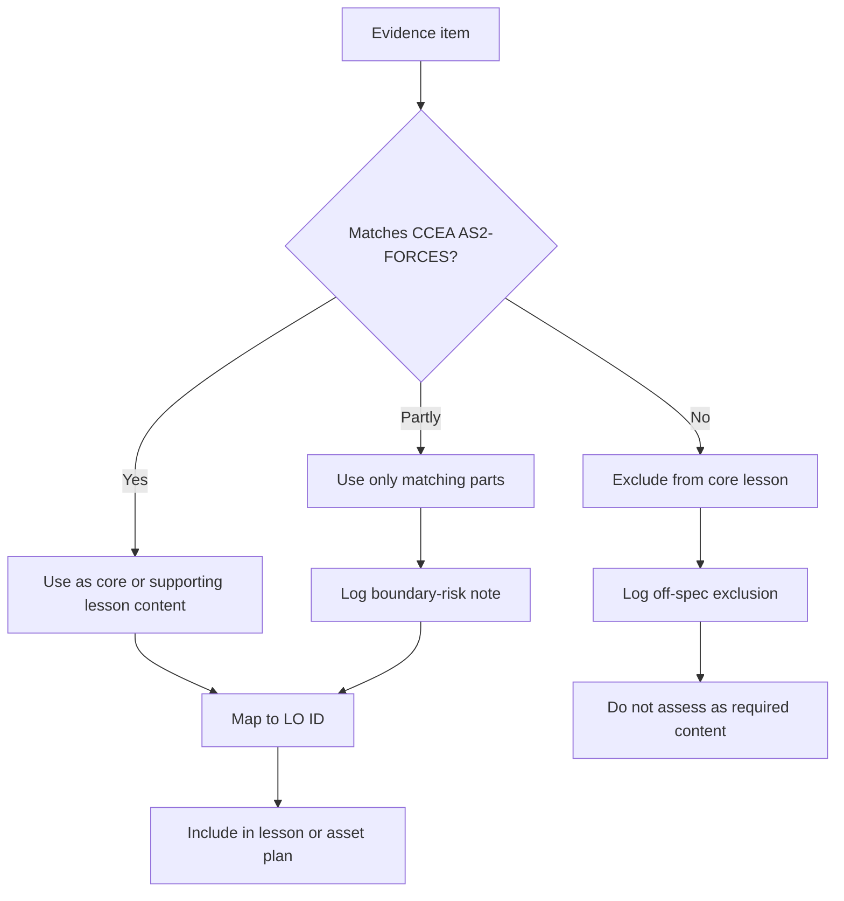

# AS2ForcesMER-010

**Asset ID:** AS2ForcesMER-010  
**Source:** CCEA specification map + project evidence checklist  
**Related lesson section:** Syllabus Gap Check and Off-Spec Log  
**Purpose:** Show how cross-board Year 2 evidence is filtered through the CCEA AS2-FORCES boundary.

