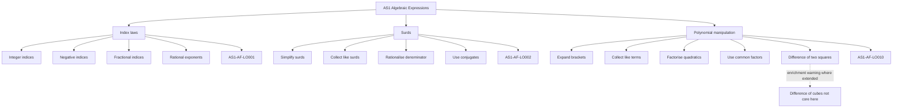

# AS1AlgebraicExpressionsMER-001

## Asset Metadata

- **Asset ID:** `AS1AlgebraicExpressionsMER-001`
- **Source:** CCEA AS1-AF specification boundary + Dr Frost Algebraic Expressions chapter overview
- **Related lesson section:** Evidence Map, Specification Alignment, Big Picture Explanation
- **Purpose:** Show how the chapter content connects to the relevant CCEA AS1 Algebra and functions learning outcomes.

