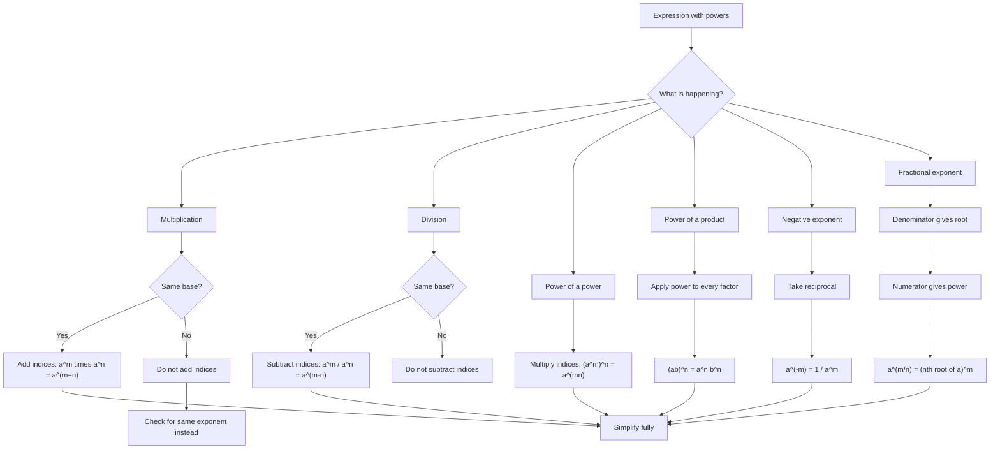

# AS1AlgebraicExpressionsMER-002

## Asset Metadata

- **Asset ID:** `AS1AlgebraicExpressionsMER-002`
- **Source:** Dr Frost index laws slide and transcript explanation
- **Related lesson section:** Core Theory, Worked Examples, Common Mistakes and Exam Traps
- **Purpose:** Help students decide which index law applies before simplifying.

