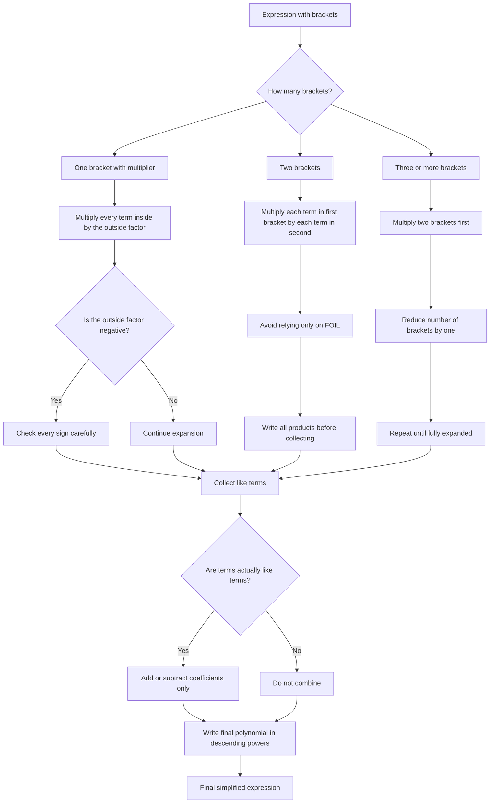

# AS1AlgebraicExpressionsMER-003

## Asset Metadata

- **Asset ID:** `AS1AlgebraicExpressionsMER-003`
- **Source:** Dr Frost expansion examples and transcript warnings about signs and collecting like terms
- **Related lesson section:** Core Theory, Worked Examples, Common Mistakes and Exam Traps
- **Purpose:** Show the safe workflow for expanding brackets and collecting terms without sign slips.

