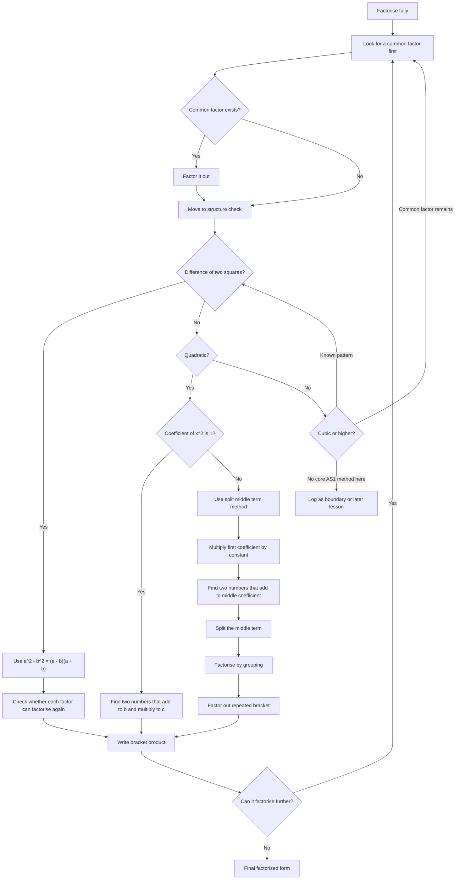

# AS1AlgebraicExpressionsMER-004

## Asset Metadata

- **Asset ID:** `AS1AlgebraicExpressionsMER-004`
- **Source:** Dr Frost factorising slides and transcript comments on common factors
- **Related lesson section:** Core Theory, Worked Examples, Guided Practice
- **Purpose:** Give a factorisation decision tree for “factorise fully” questions.

