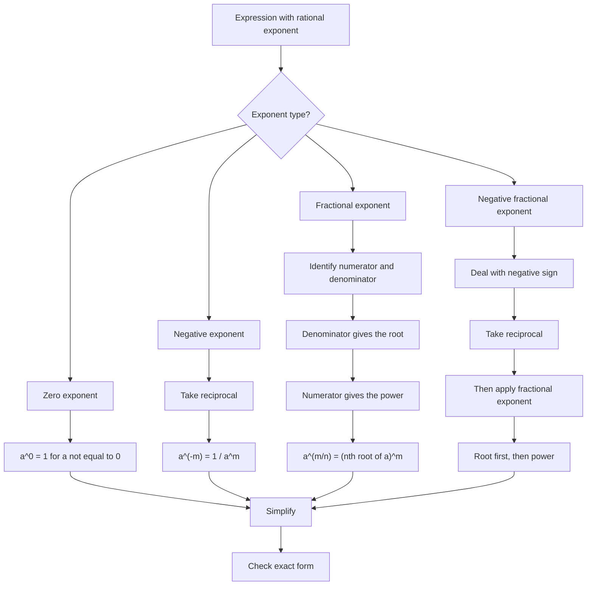

# AS1AlgebraicExpressionsMER-005

## Asset Metadata

- **Asset ID:** `AS1AlgebraicExpressionsMER-005`
- **Source:** Dr Frost fractional and negative indices examples
- **Related lesson section:** Core Theory, Worked Examples, Exam Technique
- **Purpose:** Show how to unpack a rational exponent without muddling root, power and reciprocal operations.

