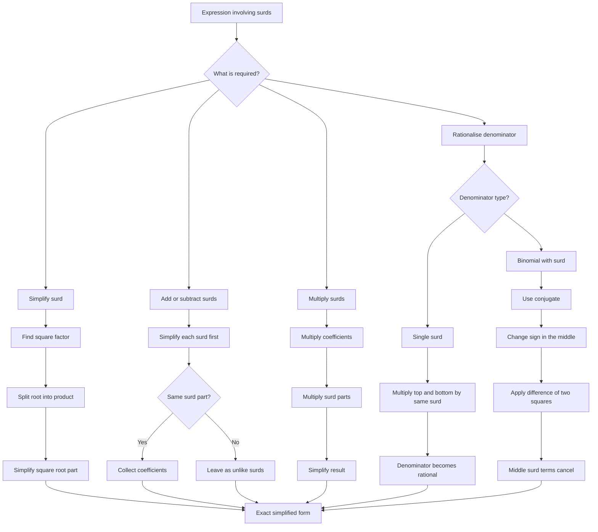

# AS1AlgebraicExpressionsMER-006

## Asset Metadata

- **Asset ID:** `AS1AlgebraicExpressionsMER-006`
- **Source:** Dr Frost surds and rationalising denominator slides and transcript
- **Related lesson section:** Surds, Rationalising the Denominator, Common Mistakes and Exam Traps
- **Purpose:** Show the decision process for simplifying surds and rationalising denominators.

