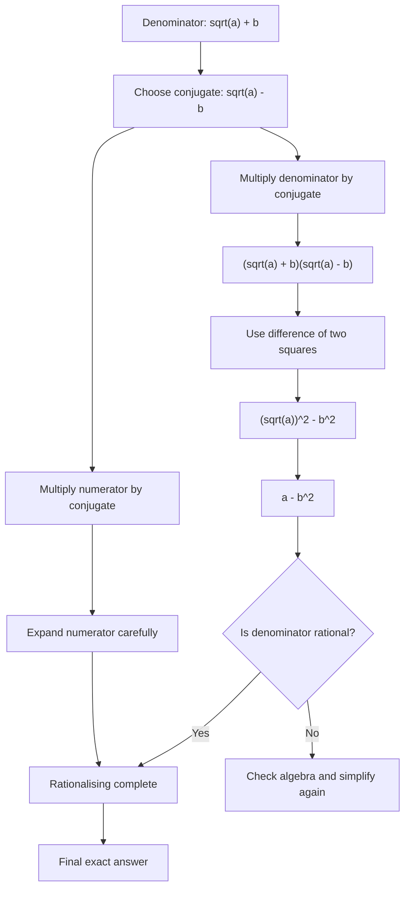

# AS1AlgebraicExpressionsMER-007

## Asset Metadata

- **Asset ID:** `AS1AlgebraicExpressionsMER-007`
- **Source:** Dr Frost rationalising denominator examples
- **Related lesson section:** Rationalising the Denominator, Worked Examples
- **Purpose:** Show why the conjugate works for denominators like `sqrt(a) + b`.

