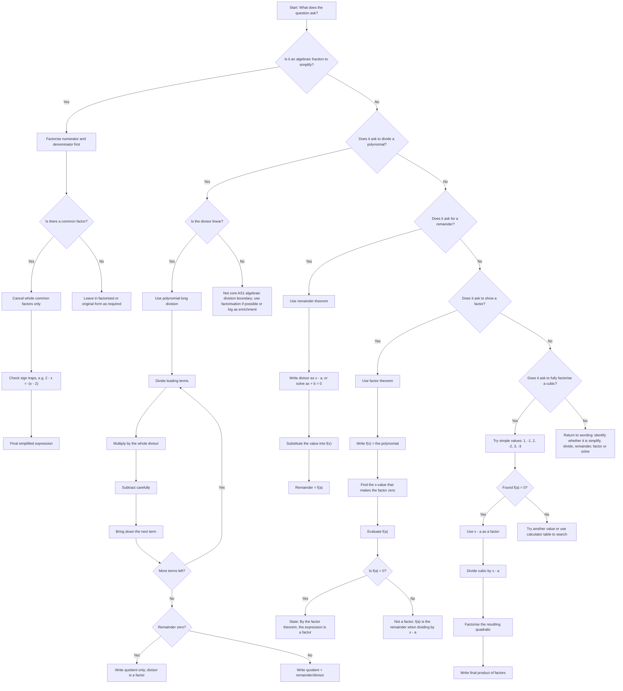

# AS1AlgebraicMethodsMER-001

## Asset Metadata

| Field | Value |
|---|---|
| Asset ID | AS1AlgebraicMethodsMER-001 |
| Asset type | Mermaid flowchart |
| Unit code | AS1 |
| Topic code | AS1-AF |
| Topic ID | AS1AlgebraicMethodsFactorTheorem |
| Related LO IDs | AS1-AF-LO010, AS1-AF-LO011 |
| Source | CCEA Mathematics Specification Map; Chapter 7a Algebraic Methods transcript; Dr Frost Algebraic Methods PDF |
| Related lesson section | Visual Asset Integration; Core Theory B-F; Exam Technique Notes |
| Purpose | Help students choose between algebraic fraction simplification, polynomial division, remainder theorem and factor theorem. |

## Mermaid Code

