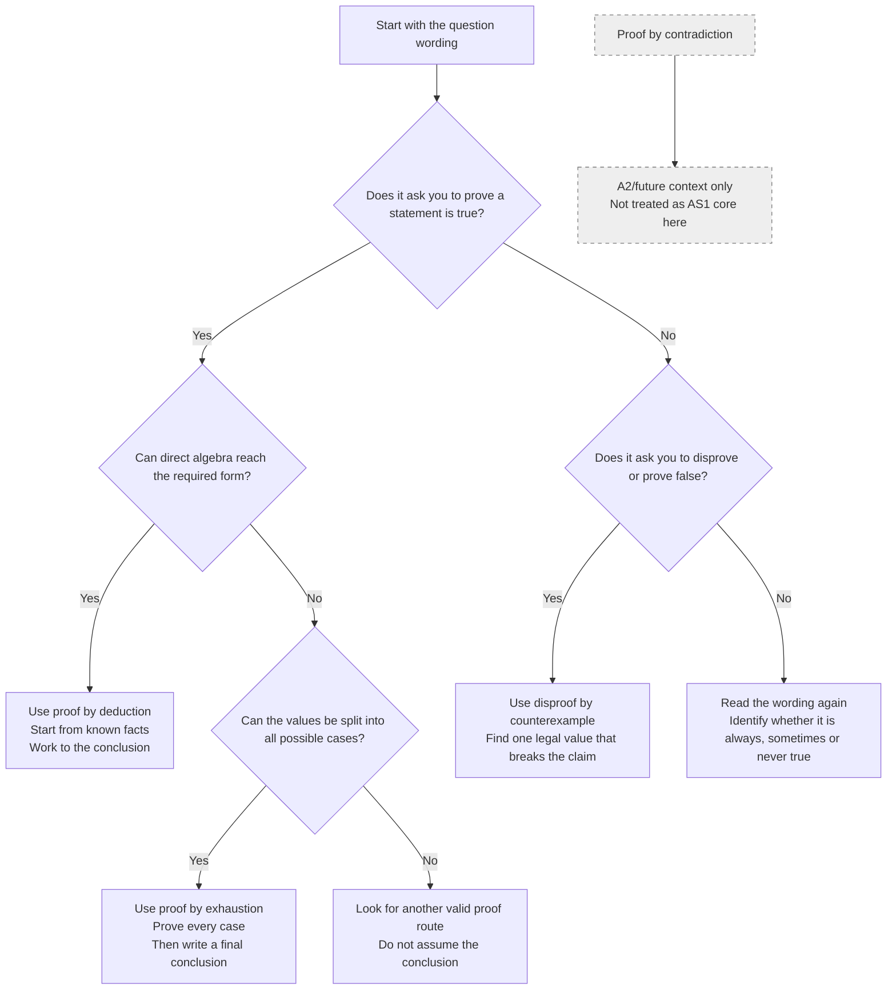

# AS1AlgebraicMethodsProofMermaid-001

**Asset ID:** `AS1AlgebraicMethodsProofMermaid-001`  
**Source:** Teacher transcript, proof overview and method definitions.  
**Related lesson section:** Big Picture Explanation; Core Theory; Exam Technique.  
**Purpose:** Show how to choose between proof by deduction, proof by exhaustion and disproof by counterexample. Proof by contradiction is shown as A2/future context only.

