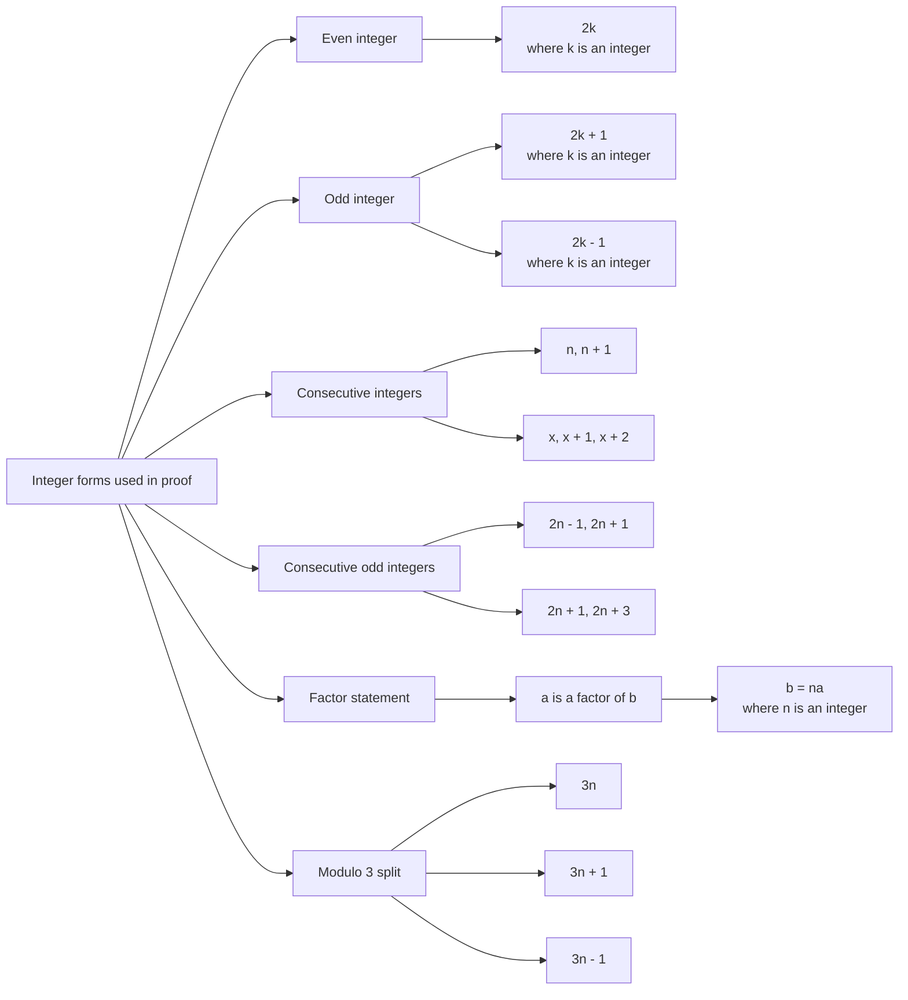

# AS1AlgebraicMethodsProofMermaid-002

**Asset ID:** `AS1AlgebraicMethodsProofMermaid-002`  
**Source:** Teacher transcript notation section on even numbers, odd numbers, consecutive integers and multiples.  
**Related lesson section:** Key Definitions and Notation.  
**Purpose:** Summarise the standard algebraic forms used in proof questions.

