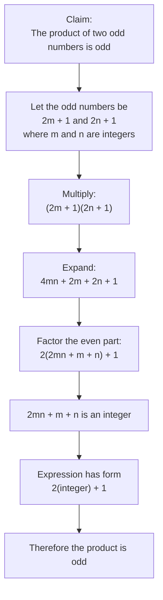

# AS1AlgebraicMethodsProofMermaid-003

**Asset ID:** `AS1AlgebraicMethodsProofMermaid-003`  
**Source:** Teacher transcript worked example: product of two odd numbers is odd.  
**Related lesson section:** Worked Example 1.  
**Purpose:** Show the proof-by-deduction algebra chain for proving the product of two odd numbers is odd.

