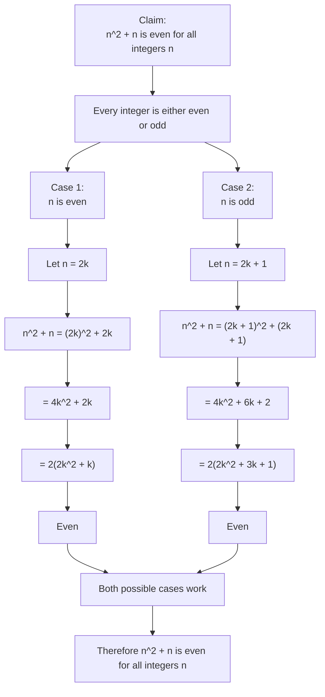

# AS1AlgebraicMethodsProofMermaid-004

**Asset ID:** `AS1AlgebraicMethodsProofMermaid-004`  
**Source:** Teacher transcript proof by exhaustion example `n^2+n` even for all integers.  
**Related lesson section:** Worked Example 6; Core Theory.  
**Purpose:** Show that proof by exhaustion must cover every possible case.

