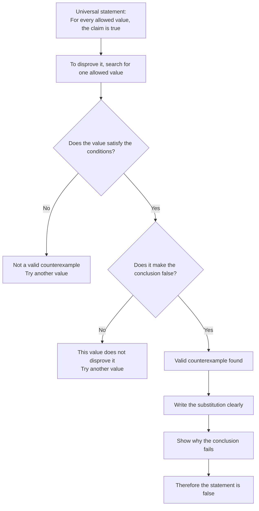

# AS1AlgebraicMethodsProofMermaid-005

**Asset ID:** `AS1AlgebraicMethodsProofMermaid-005`  
**Source:** Teacher transcript disproof by counterexample section.  
**Related lesson section:** Worked Examples 9 to 11; Exam Technique.  
**Purpose:** Show the logic of disproof by counterexample.

