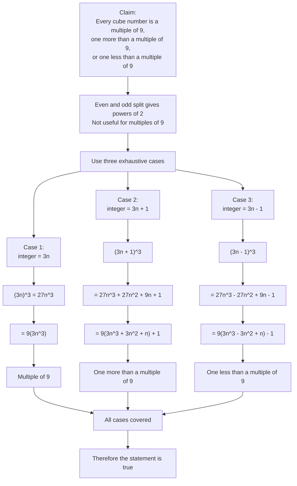

# AS1AlgebraicMethodsProofMermaid-006

**Asset ID:** `AS1AlgebraicMethodsProofMermaid-006`  
**Source:** Teacher transcript harder proof by exhaustion example: cube numbers are a multiple of `9`, one more, or one less.  
**Related lesson section:** Worked Example 8.  
**Purpose:** Show why exhaustion does not always mean even/odd, and why modulo-3 cases are chosen for cube-number questions.

