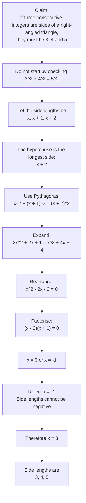

# AS1AlgebraicMethodsProofMermaid-007

**Asset ID:** `AS1AlgebraicMethodsProofMermaid-007`  
**Source:** Teacher transcript warning on not starting with the conclusion, using the `3,4,5` right-triangle proof.  
**Related lesson section:** Worked Example 5; Common Mistakes and Exam Traps.  
**Purpose:** Show the correct proof flow for consecutive integer sides of a right-angled triangle.

