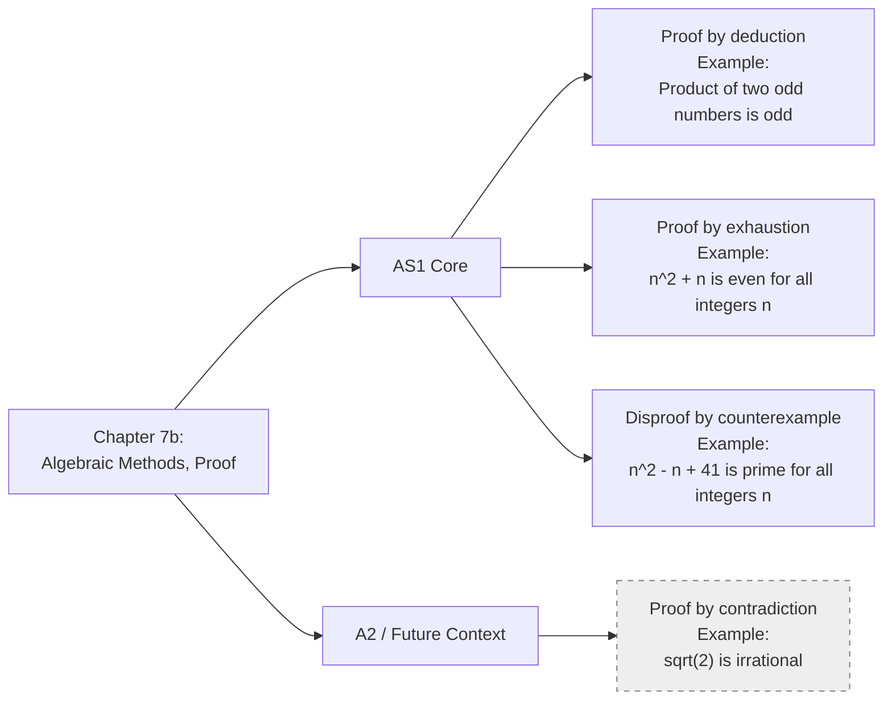

# AS1AlgebraicMethodsProofMermaid-008

**Asset ID:** `AS1AlgebraicMethodsProofMermaid-008`  
**Source:** Screenshot PDF pages 1 to 3 show the four proof-type cards; transcript states proof by contradiction is A2/future context.  
**Related lesson section:** Big Picture Explanation; Syllabus Gap Check.  
**Purpose:** Recreate the proof-type overview from the screenshots while clearly marking proof by contradiction as outside AS1 core.

