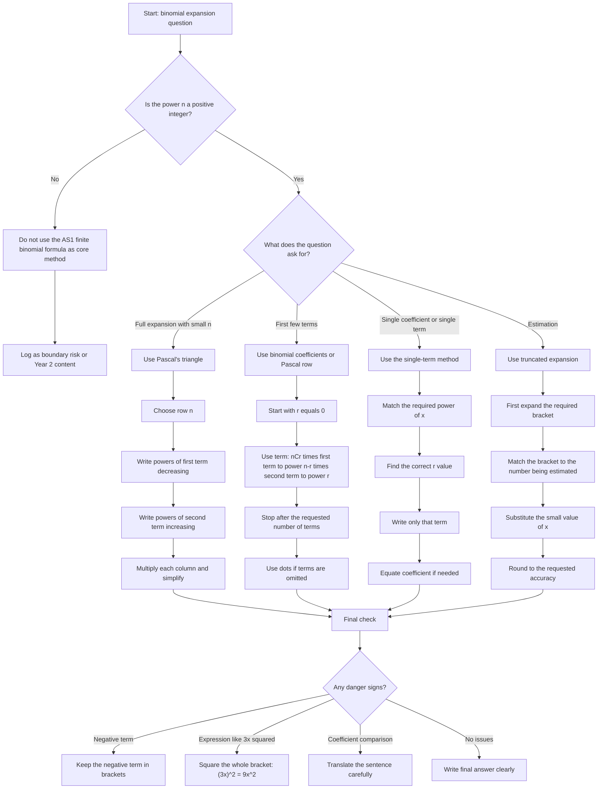

# AS1BinomialExpansionMMD-001

## Asset Metadata

| Field | Value |
|---|---|
| asset_id | AS1BinomialExpansionMMD-001 |
| file_path | mermaid/AS1BinomialExpansionMMD-001.md |
| unit_code | AS1 |
| topic_code | AS1-SS |
| topic_id | AS1BinomialExpansion |
| lesson_file | AS1_binomial_expansion_lesson.md |
| related_lesson_section | Exam Technique Notes; Worked Examples; Common Mistakes and Exam Traps |
| source | CCEA AS1 Sequences and series specification boundary; Dr Frost Chapter 8 Binomial Expansion evidence |
| purpose | Help the student decide whether to use Pascal’s triangle, binomial coefficients, a single-term method, or an estimation method. |
| linked_LOs | AS1-SS-LO001, AS1-SS-LO002 |

## Mermaid Code

