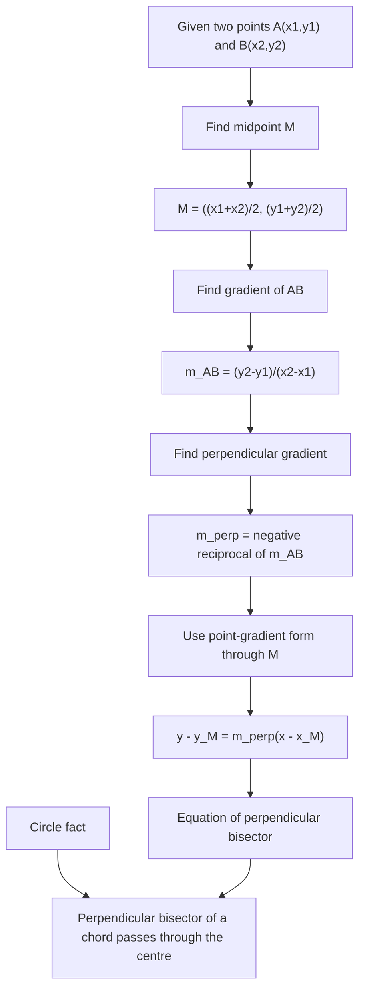

# AS1CoordinateGeometryCirclesMermaid-001

## Asset Metadata

| Field | Value |
|---|---|
| Asset ID | AS1CoordinateGeometryCirclesMermaid-001 |
| Unit code | AS1 |
| Topic code | AS1-CG |
| Topic name | Co-ordinate geometry in the \(x,y\) plane |
| Lesson focus | Circles |
| Source | Chapter 6 Circles PDF, page 3; Chapter 6 Circles transcript, Circles 1 |
| Related lesson section | Core Theory: Perpendicular bisectors; Worked Example 1 |
| Purpose | Show the calculation pathway for the perpendicular bisector of a chord or line segment. |
| CCEA alignment | AS1-CG-LO001, AS1-CG-LO002, AS1-CG-LO003, AS1-CG-LO007 |

## Mermaid Diagram

