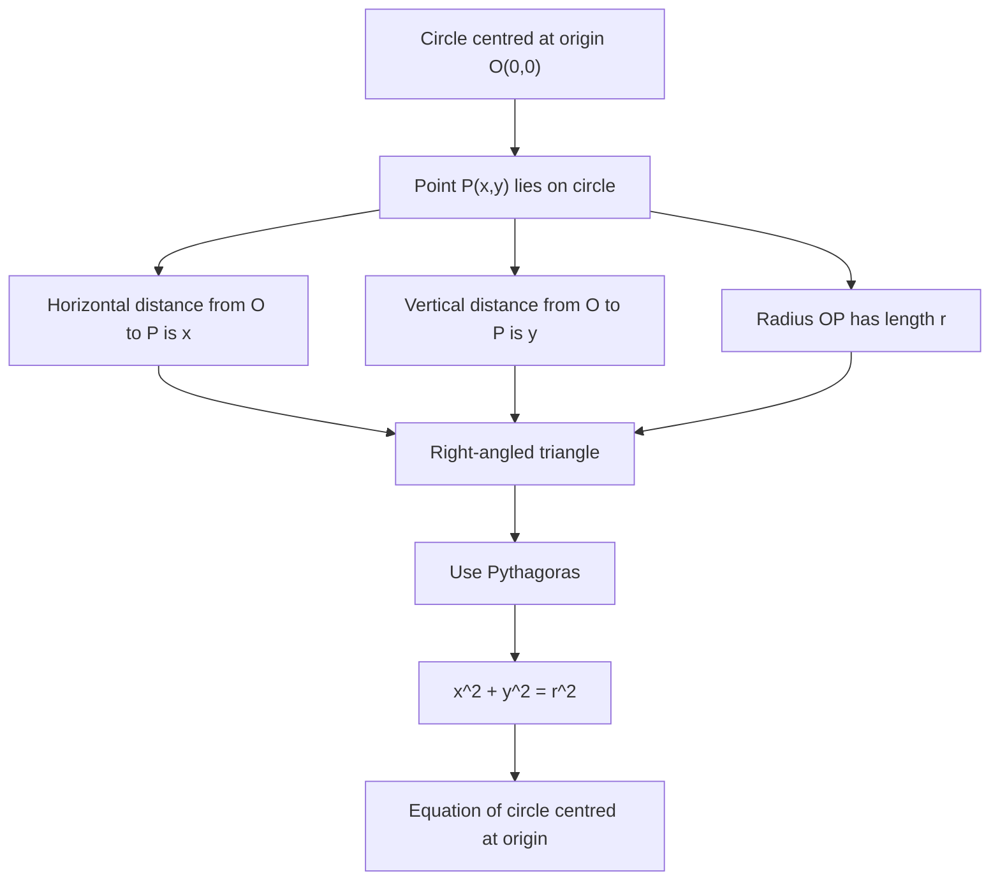

# AS1CoordinateGeometryCirclesMermaid-002

## Asset Metadata

| Field | Value |
|---|---|
| Asset ID | AS1CoordinateGeometryCirclesMermaid-002 |
| Unit code | AS1 |
| Topic code | AS1-CG |
| Topic name | Co-ordinate geometry in the \(x,y\) plane |
| Lesson focus | Circles |
| Source | Chapter 6 Circles PDF, page 6; Chapter 6 Circles transcript, Circles 2 |
| Related lesson section | Core Theory: Equation of a circle centred at the origin |
| Purpose | Show how Pythagoras gives \(x^2+y^2=r^2\). |
| CCEA alignment | AS1-CG-LO005 |

## Mermaid Diagram

