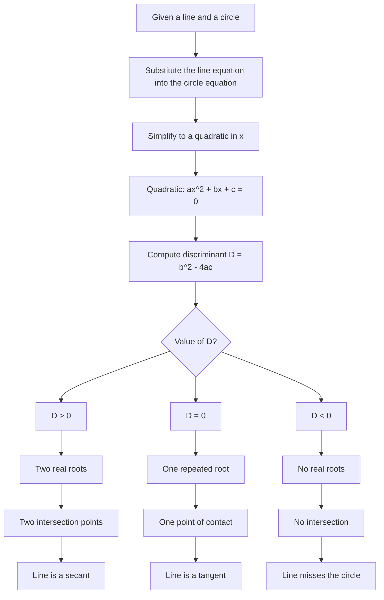

# AS1CoordinateGeometryCirclesMermaid-004

## Asset Metadata

| Field | Value |
|---|---|
| Asset ID | AS1CoordinateGeometryCirclesMermaid-004 |
| Unit code | AS1 |
| Topic code | AS1-CG |
| Topic name | Co-ordinate geometry in the \(x,y\) plane |
| Lesson focus | Circles |
| Source | Chapter 6 Circles PDF, pages 14-15; Chapter 6 Circles transcript, Circles 4 |
| Related lesson section | Core Theory: Line-circle intersections; Worked Examples 7 to 9 |
| Purpose | Show how substitution produces a quadratic and how the discriminant identifies secant, tangent or no intersection. |
| CCEA alignment | AS1-CG-LO005, AS1-AF-LO004, AS1-AF-LO006, AS1-AF-LO007 |

## Mermaid Diagram

