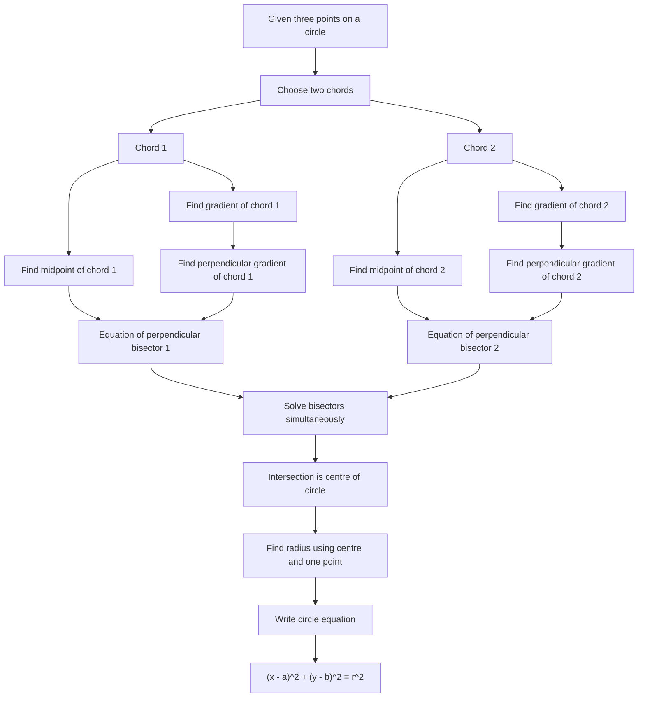

# AS1CoordinateGeometryCirclesMermaid-006

## Asset Metadata

| Field | Value |
|---|---|
| Asset ID | AS1CoordinateGeometryCirclesMermaid-006 |
| Unit code | AS1 |
| Topic code | AS1-CG |
| Topic name | Co-ordinate geometry in the \(x,y\) plane |
| Lesson focus | Circles |
| Source | Chapter 6 Circles PDF, pages 17-20; Chapter 6 Circles transcript, Circles 6 and Circles 8 |
| Related lesson section | Core Theory: Perpendicular bisector of a chord; Guided Practice 5 |
| Purpose | Show how two chord perpendicular bisectors meet at the circle centre. |
| CCEA alignment | AS1-CG-LO001, AS1-CG-LO002, AS1-CG-LO003, AS1-CG-LO005, AS1-CG-LO007 |

## Mermaid Diagram

